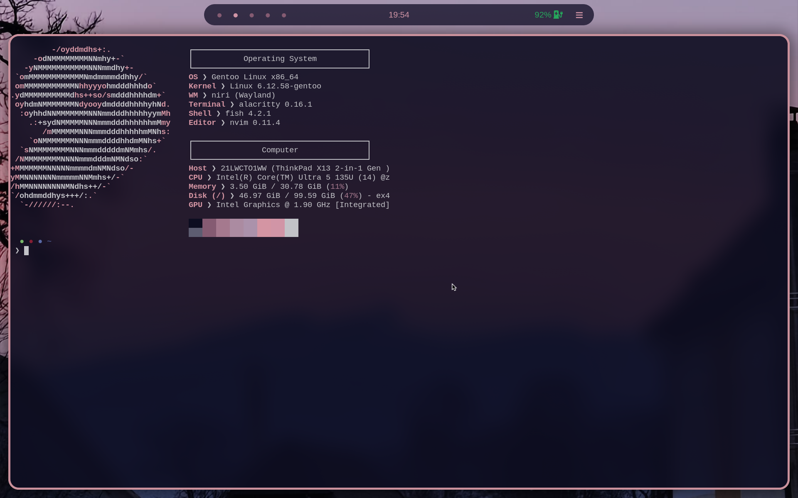

Laptop Dotfiles
================


These are my Laptops dotfiles<br>
The contents of this repository are licensed under the MIT license. For details see the LICENSE file.<br>



More screenshots (and the wallpaper) are available [here](img/)

Usage
=====
WARNING: Following these instructions may overwrite or delete your existing configuration files. 
You assume full responsibility for any data loss, system damage, or other issues. 
Always back up important files before proceeding.

To use my dotfiles, do the following:
- Back up your existing ~/.config folder, for example using 
```bash
mv ~/.config ~/.config.bak
```
- Prepare the empty .config folder using 
```bash
mkdir ~/.config
```
- Clone this repository into ~/.config<br>
```bash
git clone https://github.com/LarsLerchbacher/dotfiles-laptop ~/.config
```
- Copy over all required configurations, that do not conflict with the ones from this repo, from ~/.config.bak into ~/.config
- Install the required programs:
    - Niri
    - Alacritty
    - Waybar
    - PyWal16
    - fastfetch
    - fish
- Reboot

And you're good to go!


About this machine
==================

I use my laptop primarily for school. It dual boots Gentoo with Windows 11.<br>
Niri is currently my favourite WM, but I have KDE Plasma installed, as a reliable backup,<br>
should I break my niri config, so I can still use it for school.


Color themes
============

For this rice, I mostly used pywal and supplemented it with Catppuccin Mocha, where creating my own theme was too complex (Kvantum for example)

